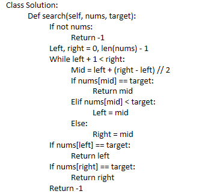

# 236. Lowest Common Ancestor of a Binary Tree



Given a binary tree, find the lowest common ancestor (LCA) of two given nodes in the tree.

According to the [definition of LCA on Wikipedia](https://en.wikipedia.org/wiki/Lowest\_common\_ancestor): “The lowest common ancestor is defined between two nodes `p` and `q` as the lowest node in `T` that has both `p` and `q` as descendants (where we allow a node to be a descendant of itself).”

**Example 1:**


<pre><code><strong>Input: root = [3,5,1,6,2,0,8,null,null,7,4], p = 5, q = 1
</strong><strong>Output: 3
</strong><strong>Explanation: The LCA of nodes 5 and 1 is 3.
</strong></code></pre>

**Example 2:**


<pre><code><strong>Input: root = [3,5,1,6,2,0,8,null,null,7,4], p = 5, q = 4
</strong><strong>Output: 5
</strong><strong>Explanation: The LCA of nodes 5 and 4 is 5, since a node can be a descendant of itself according to the LCA definition.
</strong></code></pre>

**Example 3:**

<pre><code><strong>Input: root = [1,2], p = 1, q = 2
</strong><strong>Output: 1
</strong></code></pre>

**Constraints:**

* The number of nodes in the tree is in the range `[2, 105]`.
* `-109 <= Node.val <= 109`
* All `Node.val` are **unique**.
* `p != q`
* `p` and `q` will exist in the tree.

Related Topics

* Tree
* Depth-First Search
* Binary Tree

\


* 👍 13507
* 👎 324

## Solution

```python
class Solution:
    def lowestCommonAncestor(self, root: 'TreeNode', p: 'TreeNode', q: 'TreeNode') -> 'TreeNode':
        # 1. parameter: root, p, q, return value: TreeNode
        # 2. ending: root == p || q
        # 3. each level: judge left/right has p/q
        if not root:
            return root
        if root == p or root == q:
            return root
        left = self.lowestCommonAncestor(root.left, p, q)
        right = self.lowestCommonAncestor(root.right, p, q)
        if left and right:
            return root
        if left:
            return left
        if right:
            return right
        return None
```



1. 求最小公共祖先，需要**从底向上遍历**，那么二叉树，只能通过**后序遍历（即：回溯）**实现从底向上的遍历方式。
2. 在回溯的过程中，必然要遍历整棵二叉树，即使已经找到结果了，依然要把其他节点遍历完，因为要使用递归函数的返回值（也就是代码中的left和right）做逻辑判断。
3. 要理解如果返回值left为空，right不为空为什么要返回right，为什么可以用返回right传给上一层结果。
